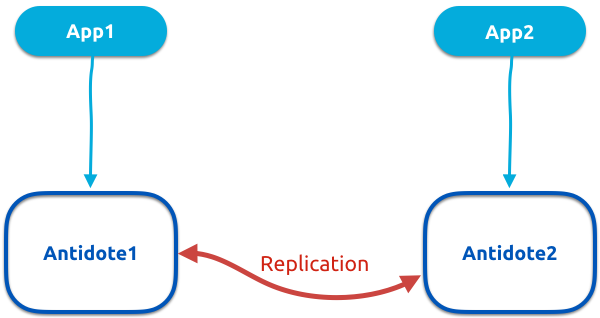

# AntidoteDB Java Tutorial

This is a sample application to demonstrate how to build applications that use [AntidoteDB][AntidoteDB-website] as backend database.

This tutorial is made for [Antidote Bookstore Tutorial](https://github.com/AntidoteDB/antidote-java-tutorial)

## What you need
* [Docker](https://docs.docker.com/engine/installation/)
* [docker-compose](https://docs.docker.com/compose/install/)
* An IDE for java development

## Clone source code
git clone https://github.com/AntidoteDB/antidote-java-tutorial

## Getting started
This repository is divided into two source directories:
* `setup`: scripts and docker files for running two instances of Antidote and two instances of the Java application
* `bookstore`: source of the tutorial application

| Note: make sure you have the software requirements listed above before following next steps. |
| --- |

### Step 1 : Starting antidote nodes
The following script starts two antidote docker containers and set up the inter-dc replication.
```bash
# in setup/
./start_antidote.sh
```

### Step 2 : Interactive Tutorial / Game
The interactive tutorial is an executable that presents a series of tasks/challenges. Each task has an outcome, SUCCESS or FAIL.
Solving a task allows you to try out the next task.
To try the interactive tutorial:

Open a new shell:
```bash
# in setup/
./tutorial_setup.sh
# build the tutorial
root@tutorial$ ./gradlew build
# run the tutorial executable
root@tutorial$ ./tutorial.sh
```

In case you want to reset your progress:
```bash
# in setup/
./stop_antidote.sh
./start_antidote.sh
```

| Note: Solving the interactive tutorial is equivalent to following steps 3, 4 and 5 bellow. Alternatively, you can skip this step and go directly to step 3.
| --- |


### Step 3 : Starting the application
Open two new shells:
* In the first one, start the first app:
```bash
# in setup/
./app1_setup.sh
# build the app code
root@app1$ ./gradlew build
# and start the app
root@app1$ ./app1.sh
# then connect the app to Antidote instance 1:
bookstore@antidote1 > connect antidote1 8087
```

* We will do the same for the second app:
```bash
# in setup/
./app2_setup.sh
# build the app code
root@app2$ ./gradlew build
# and start the app
root@app2$ ./app2.sh
# then connect the app to Antidote instance 2:
bookstore@antidote2 > connect antidote2 8087
```

We have now deployed this configuration:



### Step 4 : Try the following app commands
Some commands are already implemented in the app, lets try them:
~~~~
bookstore@antidote> inc testbucket mycounter
bookstore@antidote> getcounter testbucket mycounter
bookstore@antidote> additem testbucket myset newitem
bookstore@antidote> getset testbucket myset
~~~~

To stop the app:
~~~~
bookstore@antidote> quit
~~~~

You can also try to disconnect Antidote servers to simulate network partitions, commit some concurrent updates, then reconnect to merge CRDTs:
~~~~bash
# in setup/
./disconnect.sh #to disrupt communication between Antidote1 and Antidote2 nodes

#then update objects while disconnected

./connect.sh #connect Antidote nodes back
~~~~

To stop the two Antidote Nodes:
```bash
# in setup/
./stop_antidote.sh
```

### Step 5 : Hands On!!!
We now want to build our Bookstore app. The provided sources are divided into 3 files (located in bookstore/src/main/):
* `BookStore.java`: this file contains the command interface and the starting point of the app.
* `DemoCommandsExecutor.java`: this file contains the implementation of the demo commands we have seen in the previous Step. You can use them as examples to implement your own commands.
* `BookCommands.java`: Here is the file where you need to implement Bookstore commands, fill in the methods to add necessary.

The main method is located at bookstore/src/main/java/BookStore.java.

To re-build the app after modifying the source code:
```bash
some_docker_container$ ./gradlew build
```
where `some_docker_container` may be:
* `root@app1` or
* `root@app2` or
* `root@tutorial`

### Resources:
Some useful references:
* [Antidote API Javadoc](https://www.javadoc.io/doc/eu.antidotedb/antidote-java-client/0.3.1)
* [AntidoteDB source code](https://github.com/AntidoteDB/antidote)
* [AntidoteDB Documentation](https://antidotedb.gitbook.io/documentation/)
* [Antidote Docker reference](https://github.com/AntidoteDB/docker-antidote/blob/master/README.md)

## License
View [license information](https://github.com/AntidoteDB/antidote/blob/master/LICENSE) for the software contained in this image.

[AntidoteDB-website]: https://www.antidotedb.eu/
